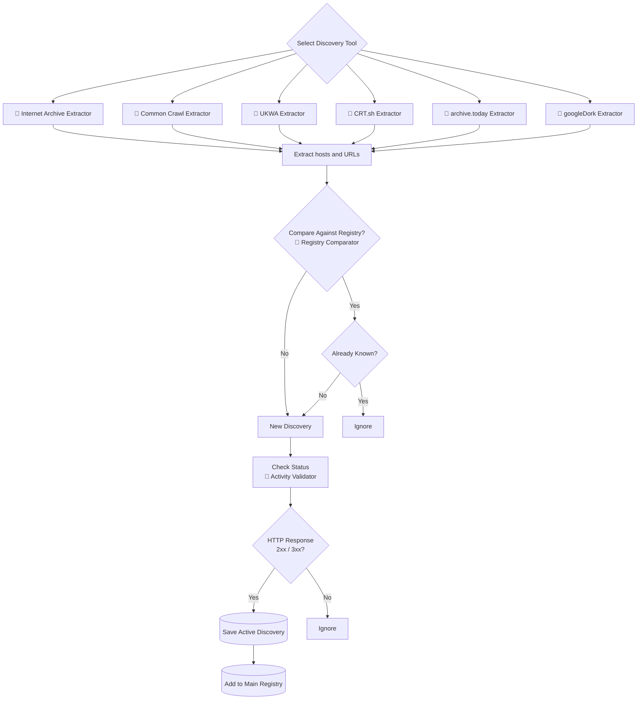

# Lost and Found

## Overview

*Lost and Found* is an OSINT multi-tool for uncovering forgotten hosts and URLs, retired services, archived webpages and content missing from existing web estate registries.

It can help answer questions such as:

   - What URLs exist under a domain?
   - What content has been captured historically?
   - What exists outside our current registry?
   - Which forgotten services are still online?
   - Where are the gaps in web archive coverage?

Originally developed for web archiving and web estate mapping at [Heritage Collections, The University of Edinburgh](https://library.ed.ac.uk/heritage-collections).

[*Hack the planet!*](https://youtu.be/IESEcsjDcmM?si=bmouYIf1L-Z_yxzP&t=262)

## Installation

   1. Clone the repository:

      ```bash
      git clone https://github.com/UoEMainLibrary/lost-and-found.git
      cd lost-and-found
      ```

   2. Install Python 3.10 or newer ([download Python](https://python.org/downloads/))

   3. Install required packages:

      ```bash
      pip install -r requirements.txt
      ```

   4. Create a uniquely named folder inside the [`input/`](input/) folder, then place your web estate registry file in that folder. For example:

      ```
      input/
      └── my_registry/
          └── urls.csv
      ```

> [!TIP]
> Your registry should be a CSV file containing URLs that *Lost and Found* can extract and process. It may originate from any source, including existing inventories, CMS exports, previous crawl outputs, web archive seed lists, or manually curated URL collections.

## Quick Start

   1. Discover hosts and URLs under a domain using one of the available [Discovery Tools](#toolkit):

      ```bash
      python tools/internet_archive.py ed.ac.uk
      ```

   2. Compare discovered hosts and URLs against your existing registry:

      ```bash
      python tools/compare.py input/my_registry/urls.csv output/ed.ac.uk/internet_archive/hosts.csv
      ```

   3. Check whether discovered hosts and URLs are still active:

      ```bash
      python tools/validate.py output/ed.ac.uk/__comparisons/my_registry__internet_archive.csv
      ```

<div id="toolkit"></div>

## Toolkit

Tools in the *Lost and Found* toolkit are grouped by purpose:

  - **🧲 Discovery Tools**: discover hosts and URLs from external archives and datasets
  - **🔎 Analysis Tools**: process discovered hosts and URLs, compare results and validate findings

| Tool                                                            | Purpose                                                                                                                                           | File                                                 |
|-----------------------------------------------------------------|---------------------------------------------------------------------------------------------------------------------------------------------------|------------------------------------------------------|
| 🧲 [**Internet Archive Extractor**](#-internet-archive-extractor)| Extract hosts and URLs from Internet Archive's [Wayback CDX Server API](https://github.com/internetarchive/wayback/tree/master/wayback-cdx-server)|[`internet_archive.py`](tools/internet_archive.py)    |
| 🧲 [**Common Crawl Extractor**](#-common-crawl-extractor)        | Extract hosts and URLs from the [Common Crawl CDX URL Index](https://index.commoncrawl.org/)                                                      |[`common_crawl.py`](tools/common_crawl.py)            |
| 🧲 [**UKWA Extractor**](#-ukwa-extractor)                        | Extract hosts and URLs from [UKWA seed lists](https://bl.iro.bl.uk/collections/5379d014-1774-46e1-a96a-7089e7c814a3?locale=en)                    |[`ukwa.py`](tools/ukwa.py)                            |
| 🧲 [**CRT.sh Extractor**](#-crtsh-extractor)                     | Extract hosts from [CRT.sh certificate transparency logs](https://crt.sh/)                                                                        |[`crt_sh.py`](tools/crt_sh.py)                        |
| 🧲 [**archive.today Extractor**](#-archivetoday-extractor)       | Extract hosts and URLs from search results of [archive.today](https://archive.ph/)                                                                |[`archive_today.user.js`](tools/archive_today.user.js)|
| 🧲 [**googleDork Extractor**](#-googledork-extractor)            | Extract hosts from [googleDorks ("dorking")](https://web.archive.org/web/20021208144443/http://johnny.ihackstuff.com/security/googleDorks.shtml)  |[`googledork.user.js`](tools/googledork.user.js)      |
| 🔎 [**Registry Comparator**](#-registry-comparator)              | Compare two registries to identify new hosts and URLs                                                                                             |[`compare.py`](tools/compare.py)                      |
| 🔎 [**Activity Validator**](#-activity-validator)                | Check whether discovered hosts and URLs are still active                                                                                          |[`validate.py`](tools/validate.py)                    |

### Workflow

The recommended *Lost and Found* discovery workflow is:



## Instructions

### 🧲 Internet Archive Extractor

<details>

<summary>Click to expand</summary>
⠀

Run [`internet_archive.py`](tools/internet_archive.py) to extract hosts and URLs from Internet Archive's [Wayback CDX Server API](https://github.com/internetarchive/wayback/tree/master/wayback-cdx-server).

#### Functions

  1. Search the Internet Archive for hosts and URLs under a domain:

      ```bash
      python tools/internet_archive.py ed.ac.uk
      ```

#### Results

  - Results are written to:

      ```
      output/
      └── ed.ac.uk/
          └── internet_archive/
              ├── hosts.csv
              └── urls.csv
      ```
      
  - `urls.csv` contains discovered URLs and `hosts.csv` contains unique hosts.

<p align="right"><a href="#toolkit">Back up to the toolkit ↑</a></p>

</details>

### 🧲 Common Crawl Extractor

<details>

<summary>Click to expand</summary>
⠀

Run [`common_crawl.py`](tools/common_crawl.py) to extract hosts and URLs from the [Common Crawl CDX URL Index](https://index.commoncrawl.org/).

#### Functions

  1. Search all Common Crawl indexes for hosts and URLs under a domain:

      ```bash
      python tools/common_crawl.py ed.ac.uk
      ```

  2. Search latest Common Crawl index for hosts and URLs under a domain:

      ```bash
      python tools/common_crawl.py ed.ac.uk --latest
      ```

#### Results

  - Results are written to:

      ```
      output/
      └── ed.ac.uk/
          └── common_crawl/
              ├── hosts.csv
              └── urls.csv
      ```

  - `urls.csv` contains discovered URLs and `hosts.csv` contains unique hosts.

<p align="right"><a href="#toolkit">Back up to the toolkit ↑</a></p>

</details>

### 🧲 UKWA Extractor

<details>

<summary>Click to expand</summary>
⠀

Run [`ukwa.py`](tools/ukwa.py) to extract hosts and URLs from [UKWA seed lists](https://bl.iro.bl.uk/collections/5379d014-1774-46e1-a96a-7089e7c814a3?locale=en).

#### Functions

  1. Search a local UKWA seed list (JSON/CSV) for hosts and URLs under a domain:

      ```bash
      python tools/ukwa.py input/ukwa/urls.csv ed.ac.uk
      ```

  2. Search a remote UKWA seed list (JSON/CSV) for hosts and URLs under a domain:

      ```bash
      python tools/ukwa.py https://librarylabs.ed.ac.uk/Annotation_Curation_Tool_Metadata-Collection_Seed_List_JSON.json ed.ac.uk
      ```

#### Results

  - Results are written to:

      ```
      output/
      └── ed.ac.uk/
          └── ukwa/
              ├── hosts.csv
              └── urls.csv
      ```

  - `urls.csv` contains discovered URLs and `hosts.csv` contains unique hosts.

<p align="right"><a href="#toolkit">Back up to the toolkit ↑</a></p>

</details>

### 🧲 CRT.sh Extractor

<details>

<summary>Click to expand</summary>
⠀

Run [`crt_sh.py`](tools/crt_sh.py) to extract hosts from [CRT.sh certificate transparency logs](https://crt.sh/).

#### Functions

  1. Search CRT.sh certificate transparency logs for hosts under a domain:

      ```bash
      python tools/crt_sh.py ed.ac.uk
      ```

#### Results

  - Results are written to:

      ```
      output/
      └── ed.ac.uk/
          └── crt_sh/
              └── hosts.csv
      ```

<p align="right"><a href="#toolkit">Back up to the toolkit ↑</a></p>

</details>

### 🧲 archive.today Extractor

<details>

<summary>Click to expand</summary>
⠀

Use [`archive_today.user.js`](tools/archive_today.user.js) to extract hosts and URLs from search results of [archive.today](https://archive.ph/).

⚠️ [archive.today](https://archive.ph/) can be a useful research tool, but users should be aware of concerns surrounding the service. See [Wikipedia's archive.today guidance](https://en.wikipedia.org/wiki/Wikipedia:Archive.today_guidance) for more details.

#### Installation

  1. Install a userscript manager such as Tampermonkey ([install Tampermonkey](https://tampermonkey.net/))

  2. Open the userscript in your browser ([open userscript](https://github.com/UoEMainLibrary/lost-and-found/raw/refs/heads/main/tools/google_dorking.user.js))

  3. Wait for Tampermonkey to detect the userscript, then click **Install**

#### Functions

  1. Open the archive.today 'wildcard' search page ([https://archive.ph/search/?q=*](https://archive.ph/search/?q=*))

  2. Append your target domain after the existing *. in the search query and click **Search** ([pre-filled search](https://archive.ph/search/?q=*.ed.ac.uk)).

  3. Click **Start** in the userscript interface and wait for it to process all available results pages

  4. Wait until the extraction process is complete, then click **Export** to download the results or **Copy** to copy them to your clipboard

  5. Click **Reset** to clear stored results before starting a new search

#### Results

  - Exported results will be saved to your Downloads folder. We recommend adding the results to the repository under:

        output/
        └── ed.ac.uk/
            └── archive_today/
                └── urls.csv

<p align="right"><a href="#toolkit">Back up to the toolkit ↑</a></p>

</details>

### 🧲 googleDork Extractor

<details>

<summary>Click to expand</summary>
⠀

Use [`googledork.user.js`](tools/googledork.user.js) to extract hosts from Google Search results using [googleDorks ("dorking")](https://web.archive.org/web/20021208144443/http://johnny.ihackstuff.com/security/googleDorks.shtml).

#### Installation

  1. Install a userscript manager such as Tampermonkey ([install Tampermonkey](https://tampermonkey.net/))

  2. Open the userscript in your browser ([open userscript](https://github.com/UoEMainLibrary/lost-and-found/raw/refs/heads/main/tools/googledork.user.js))

  3. Wait for Tampermonkey to detect the userscript, then click **Install**

#### Functions

  1. Perform a Google search using one or [googleDorks ("dorking")](https://web.archive.org/web/20021208144443/http://johnny.ihackstuff.com/security/googleDorks.shtml) search operators. A collection of search operators can be found in this [googleDork (dorking) cheat sheet](https://gist.github.com/sundowndev/283efaddbcf896ab405488330d1bbc06)

  2. Click **Start** in the userscript interface and wait for it to process all available results pages

  3. Wait until the extraction process is complete, then click **Export** to download the results or **Copy** to copy them to your clipboard

  4. Click **Reset** to clear stored results before starting a new search

#### Results

  - Exported results will be saved to your Downloads folder. We recommend adding the results to the repository under:

        output/
        └── ed.ac.uk/
            └── googledork/
                └── urls.csv

<p align="right"><a href="#toolkit">Back up to the toolkit ↑</a></p>

</details>

### 🔎 Registry Comparator

<details>

<summary>Click to expand</summary>
⠀

Run [`compare.py`](tools/compare.py) to compare two registries to identify new hosts and URLs.

#### Functions

  1. Compare discovered hosts and URLs against your existing registry:

      ```bash
      python tools/compare.py input/my_registry/urls.csv output/ed.ac.uk/internet_archive/hosts.csv
      ```

#### Results

  - Output files are named using the folder names of the compared sources:

      ```bash
      my_registry__internet_archive.csv
      ```
  - Results are written to:

      ```
      output/
      └── ed.ac.uk/
          └── __comparisons/
              ├── my_registry__internet_archive.csv 
              └── ...
      ```

<p align="right"><a href="#toolkit">Back up to the toolkit ↑</a></p>

</details>

### 🔎 Activity Validator

<details>

<summary>Click to expand</summary>
⠀

Run [`validate.py`](tools/validate.py) to check whether discovered hosts and URLs are still active. Treats HTTP `2xx` and `3xx` responses as active.

#### Functions

  1. Check whether discovered hosts and URLs are still active:

      ```bash
      python tools/validate.py output/ed.ac.uk/__comparisons/my_registry__internet_archive.csv
      ```

#### Results

  - Output files are named automatically using the source file name:

      ```bash
      my_registry__internet_archive__live.csv
      ```

  - Results are written to:

      ```
      output/
      └── ed.ac.uk/
          └── __live/
              ├── my_registry__internet_archive__live.csv
              └── ...
              
      ```

<p align="right"><a href="#toolkit">Back up to the toolkit ↑</a></p>

</details>

## Credits

Developed by David Mahoney at [Heritage Collections, The University of Edinburgh](https://library.ed.ac.uk/heritage-collections).

## Citing

If you use, implement, or reference this project, please cite it as '*Lost and Found*' and include clear attribution in publications, software, or documentation where appropriate.

## Licenses

*Lost and Found* is licensed under [Apache 2.0](https://tldrlegal.com/license/apache-license-2.0-(apache-2.0)). For full licensing details, see the [LICENSE](/LICENSE) file.